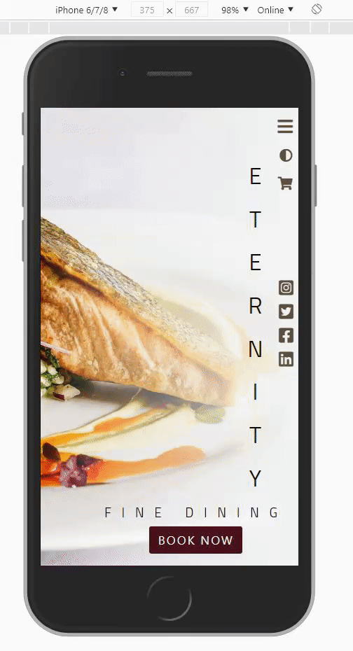
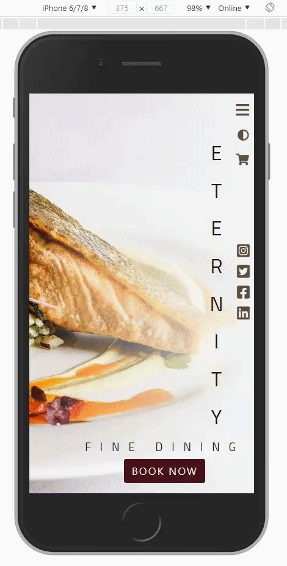
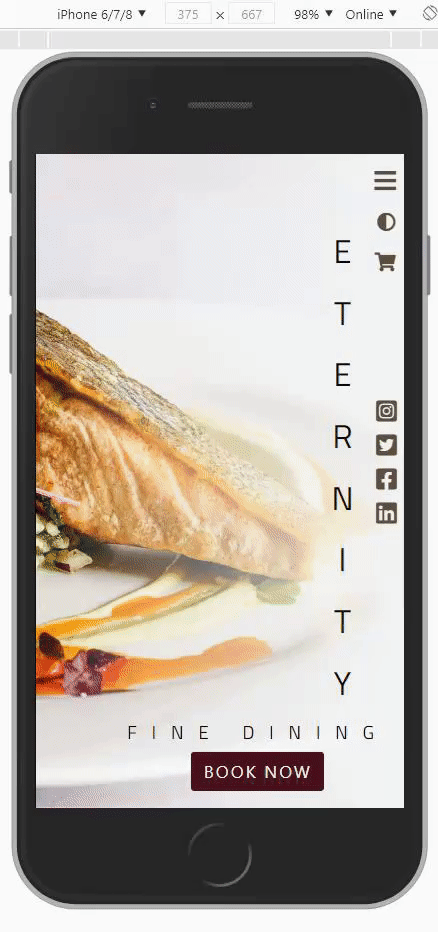
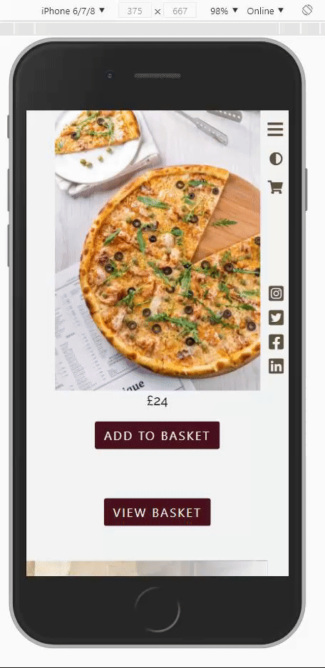
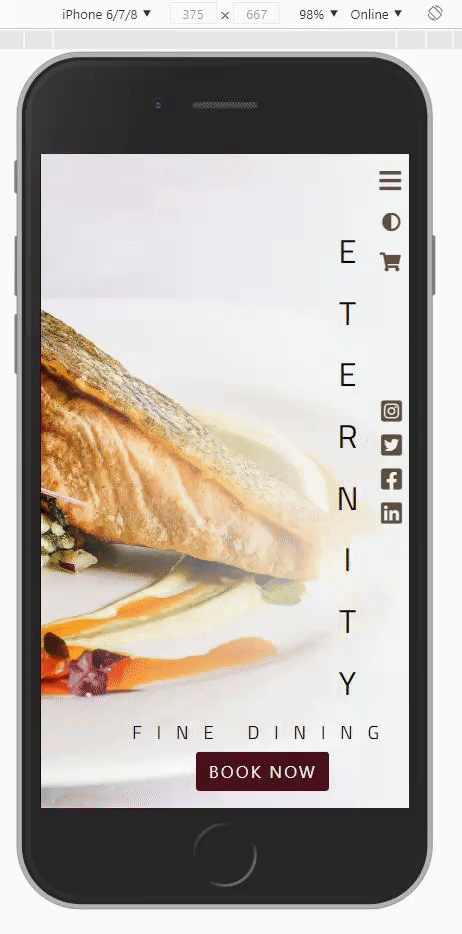

# TESTING

This project has been tested throughout with the use of preview, DevTools, manual testing and also the website was deployed on GitHub pages very early in development to allow live testing after each commit was made.

---

## MID STAGE TESTING REVIEW

### HTML

- I ran my index.html code through [W3C HTML Validator](https://validator.w3.org)
- And received 8 errors/warnings [Error's Image](https://github.com/Birrellc/Eternity-MS2/tree/master/assets/images/testing-images/html-validator-errors.png/)
- 1 by 1 each error has been located and corrected and the results now display 0 errors / warnings [Error's Fixed Image](https://github.com/Birrellc/Eternity-MS2/tree/master/assets/images/testing-images/html-validator-fixed.png/)
- Using the preview feature of my IDE I have found that the corrected code has caused an issue with the position of my "\\
" element for my contact page which will now have to be adjusted via CSS.

---

### CSS

- I ran my styles.css code through [W3C CSS Validator](https://jigsaw.w3.org/css-validator/)
- No Errors received [No Error Found Image](https://github.com/Birrellc/Eternity-MS2/tree/master/assets/images/testing-images/css-validator-1.png/)

---

### JAVASCRIPT

- All functions were tested for individual purpose manually via console.log & dev tools through my IDE's Live Preview.
- All functions were then further tested collectively by pushing live to my deployed page to see if any issues appeared on the live version or if any of the functions caused issues with each other.
- By combining these processes of I have been able to track issues created via my code through the commit log of my repository allowing the ability to navigate back through code to identify any errors and if necessary rolling back the code which I did on at least 1 occasion.

---

### SPEED TEST

- I ran a speed test on the live GitHub page of my website via [Google PageSpeed Insights](https://developers.google.com/speed/pagespeed/insights/)
- The results received we're poor and the website will need to be improved for speed by reducing image file sizing and better optimizing before the project is fully live [Speed test results](https://github.com/Birrellc/Eternity-MS2/tree/master/assets/images/testing-images/initial-speed-test.png)

---

### RESPONSIVE TEST

- For the responsive test i used an app called [Responsivley App](https://responsively.app/) which allowed me to view my website with multiple device sizes \(iPhone 5/5se 320px, iPhone X 375px, Ipad 768px, and a generic laptop size of 1280px\)
  
  
- I have also tested responsiveness of site and forms fully via use of devtools on my IDE preview and also on my deployed github page showing no issues with the viewports of \(320px, 375px, 414px, 768px, 1024px, 1440px, 1920px)

---

## FULL FINAL TESTING

### FEATURE TESTING - TABLE VIEW

| PAGE                | ACTION                                    | EXPECTED                                                                | RESULT |
| ------------------- | ----------------------------------------- | ----------------------------------------------------------------------- | ------ |
| Home                | Clicked Navigation icon                   | Open Navigation Menu                                                    | PASS   |
| Home                | Clicked Light/Dark mode switch            | To switch between Light/Dark mode                                       | PASS   |
| Home                | Clicked Shopping Cart icon                | To open Shopping Cart modal                                             | PASS   |
| Home                | Clicked each Social Media icon            | To open correct social media website in a new browser tab               | PASS   |
| Home                | Clicked Book Now Button                   | Open the Booking Form modal                                             | PASS   |
| Home                | Refreshed page with dark mode on          | Dark mode to remain active                                              | PASS   |
| About Us            | Scroll                                    | Animation effects when scroll to this page                              | PASS   |
| Divider \#1         | Scroll                                    | Animation effects when scroll to this page                              | PASS   |
| The Menu            | Scroll                                    | Animation effects when scroll to this page                              | PASS   |
| Menu                | Click Add to basket buttons               | Add the selected item to shopping cart                                  | PASS   |
| Menu                | Click Add to basket buttons               | Text to change to "item added" & disabled for 5 seconds                 | PASS   |
| Menu                | Click View basket button                  | Open Shopping Basket                                                    | PASS   |
| Divider \#2         | Scroll                                    | Animation effects when scroll to this page                              | PASS   |
| Reservations        | Scroll                                    | Animation effects when scroll to this page                              | PASS   |
| Reservations        | Clicking Email                            | Opens customers email tool \(outlook\)                                  | PASS   |
| Reservations        | Click Tel Number                          | Opens the option to call that number on customers                       | PASS   |
| Reservations        | Click Book Now Button                     | Opens the Booking Form Modal                                            | PASS   |
| Reservations        | Click zoom in/zoom out on map             | Zooms map in and out                                                    | PASS   |
| Reservations        | Click directions/view larger maps         | Opens map in Google in a new browser tab                                | PASS   |
| Contact             | Scroll                                    | Animation effects when scroll to this page                              | PASS   |
| Contact Form        | Submit form with incorrect data           | Validation to not allow the form to send                                | PASS   |
| Contact Form        | Submit form with correct data             | Button text to "change to submitting\!" while waiting for submit        | PASS   |
| Contact Form        | Submit form with correct data             | Button text to "change to submitted\!" and disable to prevent spam      | PASS   |
| Contact Form        | Submit form with correct data             | Data to be sent to company email                                        | PASS   |
| Booking Form        | Submit form with incorrect data           | Validation to not allow the form to be sent                             | PASS   |
| Booking Form        | Submit form with correct data             | Button text to" change to submitting\!" while waiting for submit        | PASS   |
| Booking Form        | Submit form with correct data             | Button text to "change to submitted\!" and disable to prevent spam      | PASS   |
| Booking Form        | Submit form with correct data             | Emails to be sent to owner & user with the correct data                 | PASS   |
| Shopping Cart Modal | Incorrectly Fill in Form                  | Validation prevents submission                                          | PASS   |
| Shopping Cart Modal | Fill in form correctly                    | Shopping cart form submits                                              | PASS   |
| Shopping Cart Modal | Click X icon beside product name          | Delete item from basket                                                 | PASS   |
| Shopping Cart Modal | Click \- or \+ beside product in quantity | Increase or decrease the quantity of product depending which is clicked | PASS   |
| Shopping Cart Modal | Refresh page with products in basket      | Products remain in basket                                               | PASS   |

---

### HTML

- I ran my index.html code through [W3C HTML Validator](https://validator.w3.org)
- And received 8 errors/warnings [Error's Image](https://github.com/Birrellc/Eternity-MS2/tree/master/assets/images/testing-images/html-validator-final-before.png/)
- 1 by 1 each error has been located and corrected and the results now display 0 errors / warnings [Error's Fixed Image](https://github.com/Birrellc/Eternity-MS2/tree/master/assets/images/testing-images/html-validator-final-after.png/)
- Using the preview feature of my IDE i have found that the corrected code has caused an issue with the position of my "hr" element for my contact page which will now have to be adjusted via CSS.
- Forms - All have are validated with the _required_ feature to stop submission without key information e.g - Email Address or Name / Which has been tested.
- Buttons - All work correctly - Tested by clicking each button on the website.
- Map - Clicked Map was able to move the view around, zoom in and out & also able to view a larger map on Google and get directions.
- Social Media Links - I clicked each link individually which opened a new browser tab to the correct targeted addresses for each link.

---

### CSS

- I ran my code through [Auto Prefixer CSS](https://autoprefixer.github.io) to make sure my CSS has all the correct vendor prefixes.
- I ran my styles.css code through [W3C CSS Validator](https://jigsaw.w3.org/css-validator/) and received no errors.
- I applied a red border to all my elements to check for any overflow issues & there are none.

---

### JAVASCRIPT

#### OVERVIEW

- All my JavaScript code was tested via manual testing which was also then used to solve the errors I had missed [Example here](../images/testing-images/manual-testing-example.png).
- When running the DevTools to inspect the website for errors I found verbose warnings for **Violation Added for non-passive event listener to scroll blocking** - planning to discuss with ,mu mentor in the final session. - **Google map issue - can ignore** 
- Ran code through [JSHINT](https://jshint.com/) - Warnings received for using ES6 & higher which are fine to ignore as the code works in all browsers apart from Internet Explorer.
  I also received the warning

_Functions declared within loops referencing an outer scoped variable may lead to confusing semantics. (foodindex, i, basketItem, addItemToBasket, food)_ & _Functions declared within loops referencing an outer scoped variable may lead to confusing semantics. (storedBasketItems, foodIndex)_

after research of [Stack Overflow](https://stackoverflow.com/) I found that these warnings are false positives so I then created my own post to confirm that this was correct [Here](https://stackoverflow.com/a/64688795/14580125) this is also linked to in my code.
I also received the warning

_The body of a for in should be wrapped in an if statement to filter unwanted properties from the prototype._

which I also resorted to the use of [Stack Overflow](https://stackoverflow.com/) to fix which lead to me correcting my code [Here](https://stackoverflow.com/a/64688795/14580125) credit has been given on that line of code.
[JSHINT WARNING IMAGE](../images/testing-images/jshint.png)

#### NAVIGATION

- Clicked on the **fas fa-bars** icon which is the navigation button - Navigation menu opens.
- Clicked on the **fas fa-times** icon which replaces the **fas fa-bars** icon - Navigation menu closes.
- Clicked on the **fas fa-bars** then selected the **About** link which took me to the **About Us Page** and closed the navigation menu for me. - Credit to Jon from CI slack community for peer code review where he pointed out I had forgotten to re-add the auto close when links clicked.
- Repeated the above process for all links - All worked successfully.

#### PAGES

- Clicked and also manually scrolled to all pages one by one refreshing the website each time - No issues found.

#### ANIMATION

- Scrolled through the website on mobile and desktop view - All animations caused page overflow initially which was solved by adding _overflow-x:hidden_ to **Body & HTML tags**.

#### SHOPPING CART / MENU

- Clicked **Add to Basket** buttons for all items on the menu page - all buttons changed to **Item Added** & disabled for 5 seconds correctly.
- Clicked **Add to Basket** buttons for all items on the menu page - all items loaded into shopping cart correctly in name, price, quantity & total cost.
- Clicked on **View Basket** button on the menu page - Shopping basket opened correctly.
- Clicked on the **fas fa-shopping-cart** icon - Shopping basket opened correctly.
- Clicked the **fas fa-plus** icon to increase the quantity - Correctly increased the quantity for the items selected while also increasing the total cost by the correct amount.
- Clicked the **fas fa-minus** icon to decrease the quantity - Correctly decreased the quantity for the items selected while also decreasing the total cost. (cant decrease lower than one)
- Clicked the **far fa-times-circle** icon to remove items from the basket - Worked correctly & correctly adjusted total cost.
- I re-added all items to the basket and increased the quantity of some of the items then refreshed the page to check if local storage restored the data correctly - this was successful.
- I re-added all items to the basket and increased the quantity of some of the items then closed the browser and reopened to check if local storage restored the data correctly - this was successful.
- This is as far as the shopping cart goes, I'm unable yet to create a database for storing data correctly and also setting up a functioning payment system but plan to implement this when I am capable.

#### DARK MODE

- I clicked on **fas fa-adjust** icon which successfully loaded the dark mode options and replaced the correct images also.
- I refreshed my page to check if local storage kept the dark mode settings - this was successful.
- I closed my browser and reopened to check if local storage kept the dark mode settings - this was successful.
- I clicked on **fas fa-adjust** icon again which then successfully transitioned back to light mode.

#### EMAILJS FORMS

##### BOOKING FORM

- Filled out **Booking Form** information then clicked submit - emails were sent correctly to customer & owner [Customer Email](../images/testing-images/booking-customer.png) [Owner Email](../images/testing-images/booking-owner.png)
- Also when the emails we're sent the button text changes to **Submitted** & disabled till the page refreshed to prevent spam.
- Clicked Date & Time - Was unable to select booking times and dates outside of opening hours and days accomplished by using & [TempusDominus Time & Date Plugin](https://tempusdominus.github.io/bootstrap-4/)

##### CONTACT FORM

- Filled **Contact Form** information then clicked submit - email was sent correctly to the owner [Contact Form Email](../images/testing-images/contact-email.png).
- Also when the emails we're sent the button text changes to **Submitted** & disabled till the page refreshed to prevent spam.

---

### BROWSER TESTING

#### Supported Browsers

| Opera | Chrome | Firefox | Edge | Internet Explorer |
| ----- | ------ | ------- | ---- | ----------------- |
| Y     | Y      | Y       | Y    | N                 |

All browsers were tested by:

- Clicking all buttons and waiting for desired effects.
- Testing local storage by adding items to basket and then closing / reopening the browser.
- Shopping cart was fully tested for adding items, removing, increasing, decreasing.
- All EmailJS forms were tested by filling out and submitting.
- Internet Explorer was the only browser that failed - shopping basket didn't work, issues with the text, modal containers etc. - **This Browser is not supported**

---

### SPEED TESTING

Speed Tests have been performed by using [GT Metrix](https://gtmetrix.com/) & [Google PageSpeed Insights](https://developers.google.com/speed/pagespeed/insights/)

- I Initially tested with [GT Metrix](https://gtmetrix.com/) and found there to be a huge issue with my page speed, It rated my page speed as "E" which is a 50% rating.
- In order to improve my speed it suggested I re-scale my images so that my website doesn't have to do it itself resulting in faster speeds as you can see [Here](../images/testing-images/speedtest-before.png)
- I re-scaled my images using [Photoshop](https://www.photoshop.com/en) to 294 x 440 pixels and ran the speed test again improving my results to a "B" as you can see [Here](../images/testing-images/speedtest-after.png)
- To improve my page scale to an A I would have to use a server to cache my images and also using less plugins for example [Tempus Dominus](https://tempusdominus.github.io/bootstrap-4/) to save on page loading times.
- After I ran a desktop speed test on [Google PageSpeed Insights](https://developers.google.com/speed/pagespeed/insights/) just to double-check and received a score of "95" [Here](../images/testing-images/google-speedtest.png)

---

### USER STORY TESTING

- **As a user of this website I would like to be able to browse what food is available before going to the premises so that I would not be wasting my time if there was no options I wanted.**

In order for the user to browse the food that is available at the restaurant they should:

1. Click the Navigation Icon at the top right of the screen
2. Select Menu
3. Scroll to browse the food on mobile & other smaller screen devices / On desktop the Menu is visible on one screen as two rows of 4 images.

Alternatively the user could scroll down to the menu section.

---

- **As a user, I want to be able to submit feedback to the restaurant of any suggestions, complaints or just to receive more information by email and phone in case my issue is urgent or not so urgent.**

 

The user will be able to contact the restaurant by use of a Contact form located in the **Contact** section of the website, also alternatively there is an **Email** and **Telephone number** located on the **Reservations** page to do either of these:

1. Click the **Navigation** Icon at the top
2. Select **Contact**
3. Fill out the form (form was tested further in the Final Testing -> Javascript -> EmailJS section of this document.)

or

1. Click the **Navigation Icon** at the top right of the screen
2. Select **Reservations**
3. Click on either the Email Address or Telephone number Depending which you prefer.

Alternatively the user could scroll down to each section.

- As a user, I want to be able to see what kind of environment the restaurant has through images to see if its the kind of place I would feel comfortable or to see if there is an outdoor area in case I choose to eat here in the summer.

The user will be able to view the restaurant environment through images that are spread throughout the website for example divider \#1 shows the inside of the restaurant where as
divider \#2 shows the outside, About us has two images showing a brief of food being prepared and also an image showing how food is served.

---

- **As a user, I would like the option to book a table online and by telephone so I can make a reservation in whichever manner is convenient to me.**

the user will be able to book a table online by filling out a booking form or also by emailing the restaurant. The customer also has the option to telephone the restaurant with the contact number provided on the **Reservations** page by doing the following steps below:

1. Click the **Navigation Icon** at the top right of the screen.
2. Select **Reservations**.
3. Click on either the Email Address or Telephone number Depending which you prefer.
4. Click the **Book Now** button and fill out the form when it pops up (form was tested further in the Final Testing -> Javascript -> EmailJS section of this document).

Alternatively the user could scroll down to this section or if you wish to use the booking form click the **Book Now** button located on the home page.

---

- **As a user, I would like to be able to order food online for delivery due to the current state of pandemic and not being comfortable eating out. (coronavirus 2020)**

The user will be able to order food online by selecting items from the menu and then clicking the shopping cart:

1. Click the **Navigation Icon** at the top right of the screen.
2. Select **Menu**.
3. Click the **Add To Basket** buttons under the food images to add them to your shopping cart.
4. Click either the **View Basket** at the bottom of the **Menu** page or click the shopping cart icon in the top right area.
5. Increase or decrease the quantity of each item you like and if you want to remove something click the "X" to the left of the product name.
6. Fill out the form with your details and then click Checkout.

(The cart was tested further in the Final Testing -> Javascript -> Shopping Cart section of this document & the Shopping Cart form was tested in the feature testing table)

**_NOTE - The ability to add items to the basket is functional, same with removing or increasing / decreasing the quantity but due to not having the capable skills yet the form does not direct to a paywall or store the data provided in the form, All that happens is the moment is the form data is posted to the code institute form dump which checks that the data is submitted - The database and paywall feature will be added as my skills develop later in the course_.**

---

- **As a user, I would like to have information about the history of the restaurant available on the website.**

The user will be able to find out information about the restaurant on the **About** page:

1. Click the **Navigation Icon** at the top right of the screen
2. Select **About**
3. Information needed is displayed on this page.

Alternatively the user could scroll down to this section.

---

### RESPONSIVE TESTING

- For the Responsive test i used an app called [Responsivley App](https://responsively.app/) to view my website with multiple device sizes \(iPhone 5/5se 320px, iPhone X 375px, Ipad 768px, and a generic laptop size of 1280px\)

- I have also tested the website on a desktop view of 1920x1080 pixels which worked fine.

Full list of tested resolutions with & without [Responsivley App](https://responsively.app/):

1. iPhone 5/5se 320px
2. iPhone X 375px
3. Pixel 2 411px
4. iPhone 6/7/8 Plus 414px
5. Ipad 768px
6. Nexus 10 800px
7. Generic Laptop 1280px
8. MacBook Air 1440px
9. Desktop 1920px

---
